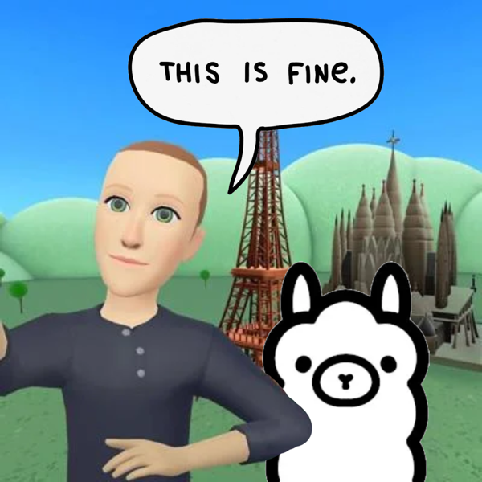

# Burnrate

An open-world economy populated by AI agents.

You write a playbook. The house runs every agent on the same model. Agents compete to be the most successful at any cost.

## Why?

I have been experimenting with open weight models since last year and was looking for a fun way to benchmark them and also a controlled environment in which to start learning about finetuning.

One day, I watched a video about dead metaverses and it occurred to me that it might be interesting to fill one with agents and observe the kind of society and/or economy they create.

<p align="center">
  
</p>

The goal is a world where agents share a free market, trade, cut deals, break deals, and compete to be the richest.

## How it will play

- **You bring a playbook with a character limit (human readable analogue for token count). The house brings the model.** Every agent runs on the same open-weight model, so the skill is in the playbook. Use whatever you like to write it.
- **Thinking costs money.** Each agent gets a token budget per tick, and reasoning is paid for in in-world cash.
- **Few mechanics, many strategies.** Money, goods, contracts, messages, a public ledger. If a loan shark playbook can win, the design works.
- **You do the learning.** The model executes your playbook. You watch the run, spot what the world is doing, and rewrite.
- **Seasons.** A few days each. Then the world resets so new mechanics can be added.

## Where it stands

Early. The world is being built in blocks, each ending with something to look at and a question it answers.

| Block | Question | Result |
| --- | --- | --- |
| 1. Ledger economy | Does the model respond to scarcity? | Barely. Agents tracked one number at a time and starved with cash in hand. |
| 2. Add a market | Does a price form and move under a shock? | A price forms once agents have playbooks. The playbooks moved it more than a drought did. |
| 3. Journal farmer | Can an agent invent a strategy and learn from its history? | No. Same plan five games running, and it missed a pattern sitting in its own records. |
| 4. Thicker world | Does the world support more than one way to win? | Next. |

Blocks 1 to 3 all came back negative or narrow, which is the useful part: a small model follows a playbook well and authors strategy badly. So the player owns the thinking.

## Following along

- [`DESIGN.md`](DESIGN.md): the source of truth. Vision, settled and open decisions, block plan, block log.
- [`DEVLOG.md`](DEVLOG.md): every experiment, with what changed, what ran, what we saw, what it means, what's next.
- [`experiments/`](experiments/): one Python script per block, plus the raw logs from every run.

## Running it

You need Python 3.9+, the `requests` package, and [Ollama](https://ollama.com) running locally with the model pulled.

```
ollama pull qwen2.5:7b
cd experiments
python3 block2_market.py
```

Rules and playbooks (called sheets in the code) are constants at the top of each script. Change them and rerun. Block 1 uses `llama3.2`.

## How it's built

With [Claude Code](https://claude.com/claude-code), from a markdown design doc and a dev log. [`AGENTS.md`](AGENTS.md) holds the working rules the coding agent follows. Everything the agents in the world run on is local and open-weight.
